# Ejecución de módelos con Transformers y API de HugginFace

El proyecto esta dividido en 3 subproyectos en 
donde en la carpeta de `tranform_local` se ejecuta 
un modelo de reconocimiento de objetos en una imágen 
por medio de Hardware en local con la librería de 
Tranformer. Las otras dos carpetas son de uso de API de
HugginFace, donde la carpeta `api_quest_answer` se usa
un modelo que responde preguntas al usuario y la
carpeta `api_multi_model` permite el usurio escoger
entre varios modelos de detección de objetos.

Para correr cualquiera de las aplicaciones primero
clona este repositorio con:

```
git clone https://github.com/MontoyaN1/transform_api.git
```

Ve a la carpeta con:

```
cd transform_api
```

Crea un entorno virtual con Python (Requiere Python 3.10 o superior) :

```
python -m venv  ./
```

Y descarga las dependencias necesarias con:

```
pip install -r requeriments.txt
```

## Requisitos

Las **dependencias** son:

* streamlit
* transformers
* requests
* io
* PIL
* torch
* matplotlib.pyplot

Y para ejecutar el modelo en local se requiere de **tesseract** que para descargarlo en Windows descargalo desde [aquí](https://github.com/tesseract-ocr/tesseract). En Linux es de la siguiente manera:

**Base Fedora**

```
sudo dnf install tesseract
```

**Base Debian**

```
sudo apt install tesseract-ocr

```


## Ejecución de un modelo en Hardware local con Transformers

Para la ejecución del modelo en local usa:

```
streamlit run ./transform_local/main_object_image.py
```

Se abrira una pestaña en el navegador en donde se vera algo como lo siguiente:


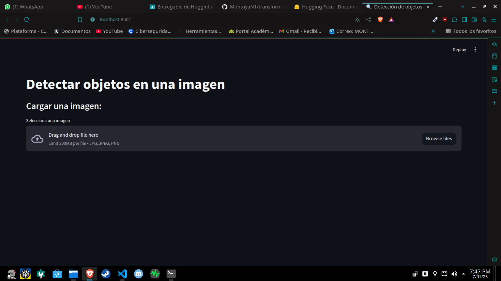

Se da click en en "Browse Files" y se selecciona una imagén.
Abajo de la imangén se carga una tabla en donde se muestra
el objeto detectado y la confianza que tiene el modelo
con respecto a su predicción.

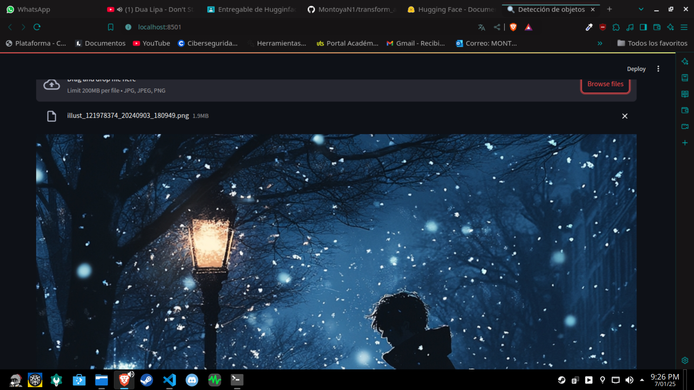
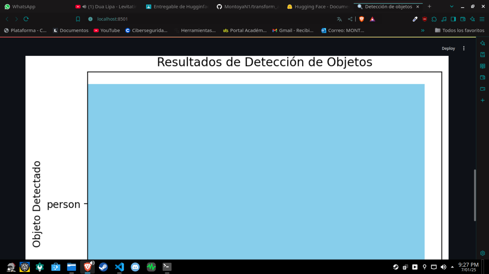
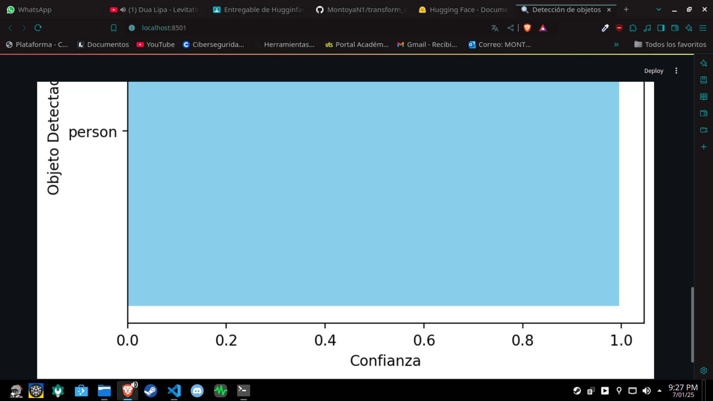


### Tranformer y ejecución de modelos en local

Transformers es una librería de HugginFace que permite 
correr de manera sencilla y fácil un modelo en local
dando al desarrollador la posibilidad de interactuar
y modificar carácteristicas del modelo.

Pero tiene sus desventajas o detalles a considerar al
compararlo al usar una API:

* **Requiere de un Hardware modesto**: Dependiendo del modelo
  y fijandonos en el número de parametros que tiene el modelo,
  por ejemplo:

  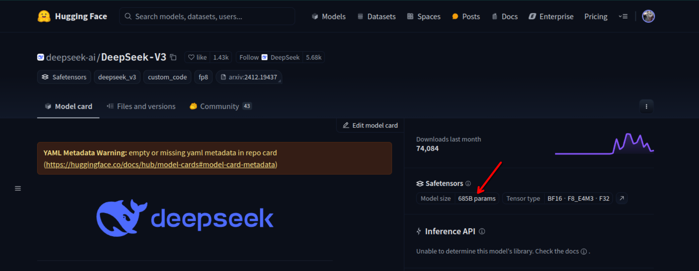

  se puede dar una aproximación de la capacidad necesaria
  de RAM, CPU  y GPU para ejecutar el modelo. También hay que
  tener en cuenta la tarea que realiza el modelo.

  El proyecto actual fue configurada para ejecutarse por
  CPU dado que con GPU necesitaría aproximadamente como
  mínimo 8 Gb de VRAM para correr. En cambio con CPU se
  basta con tener un procesador de 4 núcleos y 10 Gb de
  RAM disponible, pero esto tiene una desventaja ya que
  los modelos en CPU corren más lento a comparación de
  uno en GPU.

* **Descarga de dependencias**: Además de tener que instalar
  las librerias de requeriments algunos modelos requieren
  de cierta versión de dependecias propias para ejecutarse
  de manera local, por ejemplo el modelo usado fue `hustvl/yolos-tiny` que requiere de **tesseract** para funcionar correctamente en local.

* **Rendimiento**: Ejecutar un modelo en local con un Hardware para uso personal hace que el modelo pueda llegar a tardar largos tiempos para dar una respuesta y dicha respuesta puede que no sea la correcta o con mayor indice de error que usando una API. Esto ocurre por limitaciones del Hardware a comparación de los grandes servidores y estaciones que usan para correr en la nube.


## Uso de modelo de pregunta-respuesta con una API
  
Para la correr la aplicación usa:

```
streamlit run ./api_quest_asnwer/main_quest_answer.py
```

Se abre una pestaña del navegador y se vera lo siguiente:

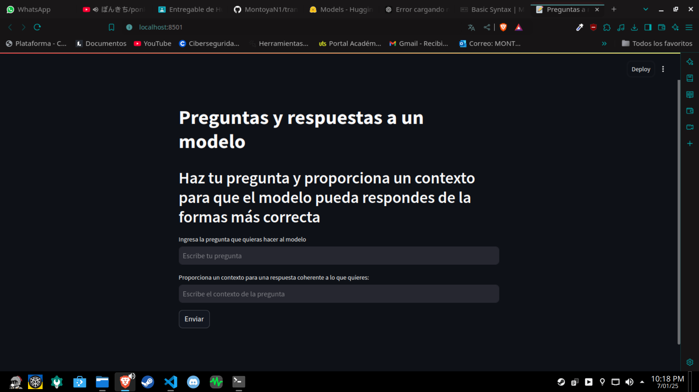

Para el desarrollo de la aplicación se usa una API del modelo `deepset/roberta-base-squad2` en donde se necesitan de dos parámetros para que el modelo de respuestas. Uno que es la pregunta y otro que es el contexto necesario para que la respuesta a la pregunta sea coherente.

**Ejemplo**:

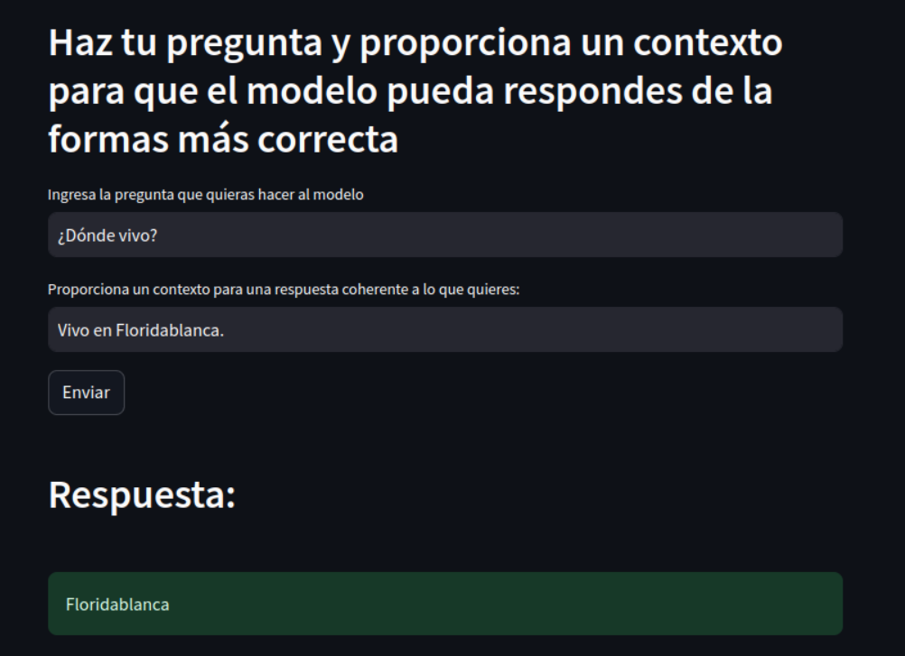


## Aplicación que permite usar varios modelos en describir una imagen

Para la correr la aplicación usa:

```
streamlit run ./api_multi_model/main_multi_model.py
```

Se vera lo siguiente:

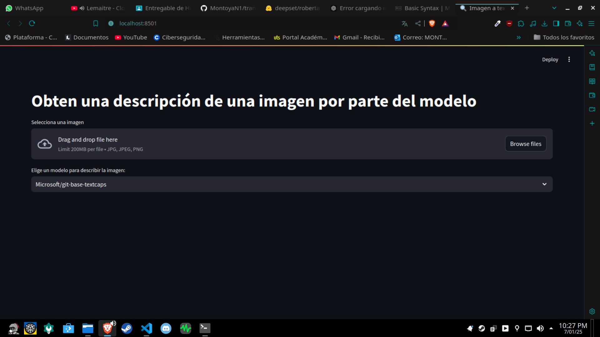

La aplicación permite al usuario escoger una imagen y seleccionar varios uno de varios modelos para obtener una descripción de dicha imagen. Los modelos usados son:

* `microsoft/git-base-textcaps`
* `Salesforce/blip-image-captioning-base`
* `nlpconnect/vit-gpt2-image-captioning`
* `Ayansk11/Image_Caption_using_ViT_GPT2`

La lógica de la aplicación se sintetiza de la siguiente manera:

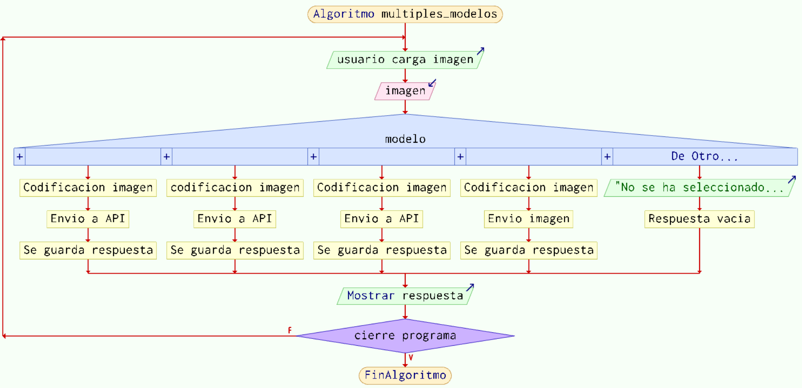


**Ejemplo**:

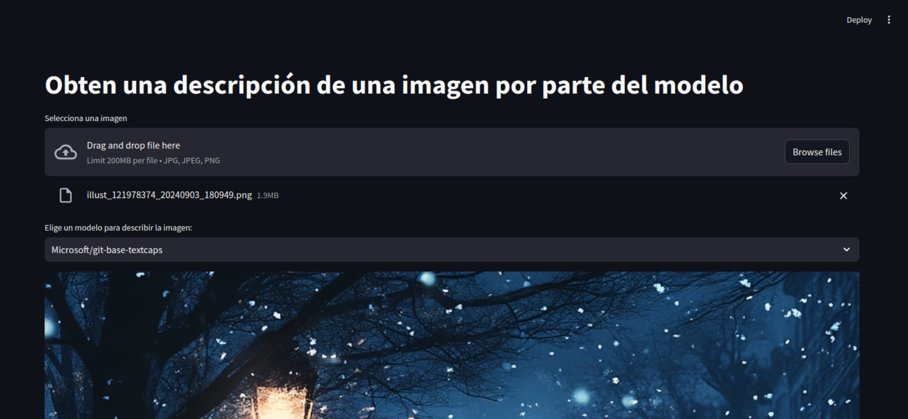

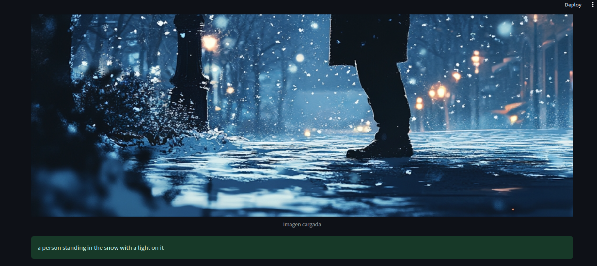
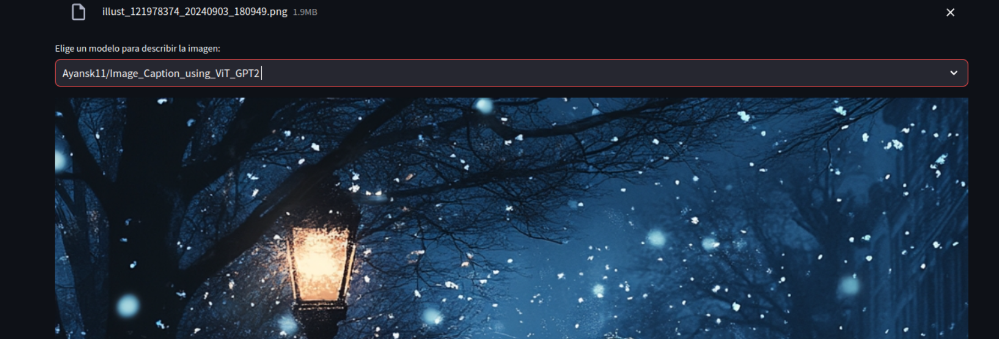
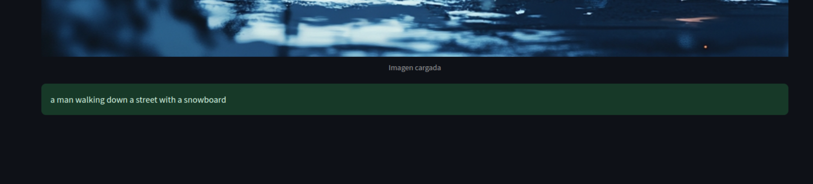